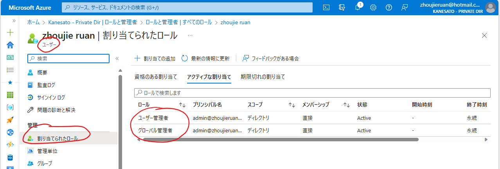
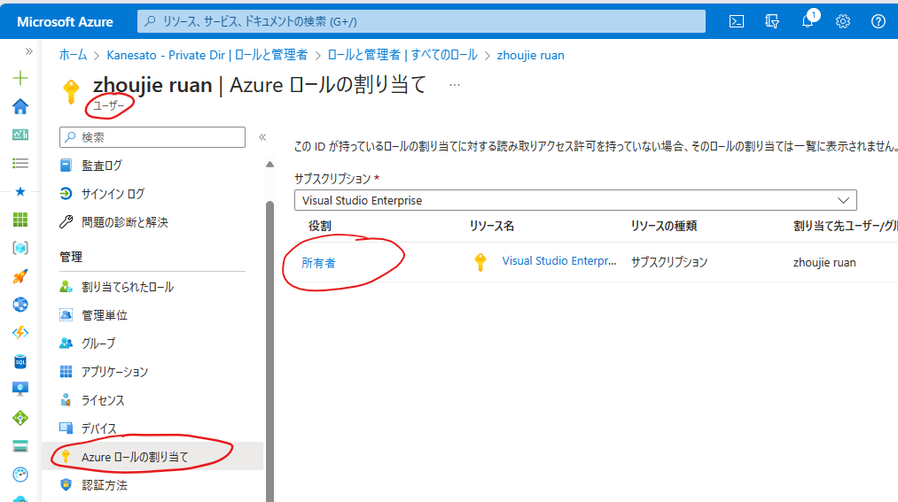

## ■Tips
|#|Content|Remark|
|---|---|---|
|1|[EA Roles](https://learn.microsoft.com/ja-jp/azure/cost-management-billing/manage/understand-ea-roles#account-owner)|-|
|2|[Azure AD Roles](https://docs.microsoft.com/ja-jp/azure/active-directory/users-groups-roles/directory-assign-admin-roles)|-|
|3|[Azure RBAC Roles](https://docs.microsoft.com/ja-jp/azure/role-based-access-control/built-in-roles)|-|

## ■Steps
1. 現ユーザの持つAADロールの確認

2. ユーザのAzure RBACロールの確認
