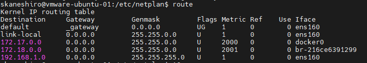

# 《Linux》 
### **■SSH(Password)ログインの設定手順**

１．apt更新とopenssh-serverのインストール 
sudo apt-get update
sudo apt-get upgrade
sudo apt-get install openssh-server

２．systemctl コマンドで openssh サーバを有効にする 
sudo systemctl enable ssh

３．SSHのパスワードログインを有効にする 
sudo vi /etc/ssh/sshd_config

---
### [参考] 
sshd_config = sshデーモンの設定ファイル（外部からssh接続されたときの設定） 
ssh_config = ssh接続の設定ファイル（外部へssh接続するときの設定）
 

sshd_configファイルに以下内容を追加 
>#パスワードによる認証を許可 
>PasswordAuthentication yes 
>#後続プロセスのため一時的に許可を与える
---

４．sshdを再起動する 
sudo service sshd restart

---
### **■複数NICインターフェースがある場合、インターフェース削除の手順**
１．route -n コマンドでNICインターフェースを確認(Iface) 

２．下記コマンドでNICインターフェースを削除 
ip l set eth0 down 
または 
nmcli c down eth0 
または 
ifconfig eth0 down 

３．再度route -n コマンドでNICインターフェースを確認(Iface) 

---
---
||||
|---|---|---|
|#|URL|remark|
|1|[新しいユーザの作成方法](https://qiita.com/RYOSKATE/items/81b564b2ab281ec7f27d#:~:text=%E3%83%A6%E3%83%BC%E3%82%B6%E3%83%BC%E3%81%AE%E8%BF%BD%E5%8A%A0%20sudo%20adduser%20%E6%96%B0%E3%81%97%E3%81%84%E3%83%A6%E3%83%BC%E3%82%B6%E3%83%BC%E5%90%8D%20%E7%B6%9A%E3%81%84%E3%81%A6%E3%83%91%E3%82%B9%E3%83%AF%E3%83%BC%E3%83%89%E3%81%AE%E5%85%A5%E5%8A%9B%20%28%E5%86%8D%E5%85%A5%E5%8A%9B%E7%A2%BA%E8%AA%8D%E6%9C%89%E3%82%8A%29%20%E3%81%9D%E3%81%AE%E5%BE%8C%E3%81%AF%E3%83%95%E3%83%AB%E3%83%8D%E3%83%BC%E3%83%A0%E3%81%AA%E3%81%A9%E3%81%AE%E3%82%AA%E3%83%97%E3%82%B7%E3%83%A7%E3%83%B3%E5%85%A5%E5%8A%9B,%E3%83%A6%E3%83%BC%E3%82%B6%E3%83%BC%E3%81%AE%E5%89%8A%E9%99%A4%20sudo%20userdel%20-r%20%E5%89%8A%E9%99%A4%E3%81%97%E3%81%9F%E3%81%84%E3%83%A6%E3%83%BC%E3%82%B6%E3%83%BC%E5%90%8D%20-r%20%E3%81%AFhome%E3%81%AE%E3%83%87%E3%82%A3%E3%83%AC%E3%82%AF%E3%83%88%E3%83%AA%E3%82%82%E4%B8%80%E7%B7%92%E3%81%AB%E5%89%8A%E9%99%A4%E3%81%99%E3%82%8B%E3%82%AA%E3%83%97%E3%82%B7%E3%83%A7%E3%83%B3)
|2|PINGがタイムアウトの場合|NIC Interfaceが複数で優先度の高いNIC Ifaceは想定のものではないのが原因の可能性あり。 不要なNIC Ifaceを削除する|
||||

