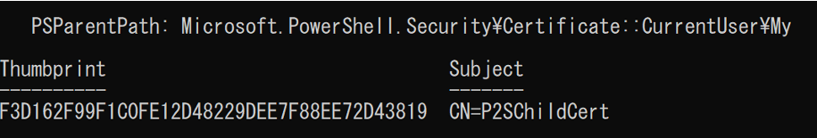

＜P2S - Azure VPNGWにてP2S接続でVPN構築＞

１．必要なリソース作成
Subs、RG、VNET、Subnet

２．VPN構築

３.自己署名ルート証明書の作成

$cert = New-SelfSignedCertificate -Type Custom -KeySpec Signature `
-Subject "CN=P2SRootCert" -KeyExportPolicy Exportable `
-HashAlgorithm sha256 -KeyLength 2048 `
-CertStoreLocation "Cert:\CurrentUser\My" -KeyUsageProperty Sign -KeyUsage CertSign
 ---
 From <https://learn.microsoft.com/ja-jp/azure/vpn-gateway/vpn-gateway-certificates-point-to-site#rootcert> 

**《結果》**
結果は$cert変数に入れたため、Powershellを閉じないまま次のステップへ進めてください

４.クライアント証明書の生成
New-SelfSignedCertificate -Type Custom -DnsName P2SChildCert -KeySpec Signature `
-Subject "CN=P2SChildCert" -KeyExportPolicy Exportable `
-HashAlgorithm sha256 -KeyLength 2048 `
-CertStoreLocation "Cert:\CurrentUser\My" `
-Signer $cert -TextExtension @("2.5.29.37={text}1.3.6.1.5.5.7.3.2")
 

５．クライアント証明書をローカルPCにインストール

６．P2Sコネクション構築（ルート証明書必要）

７．デプロイ
