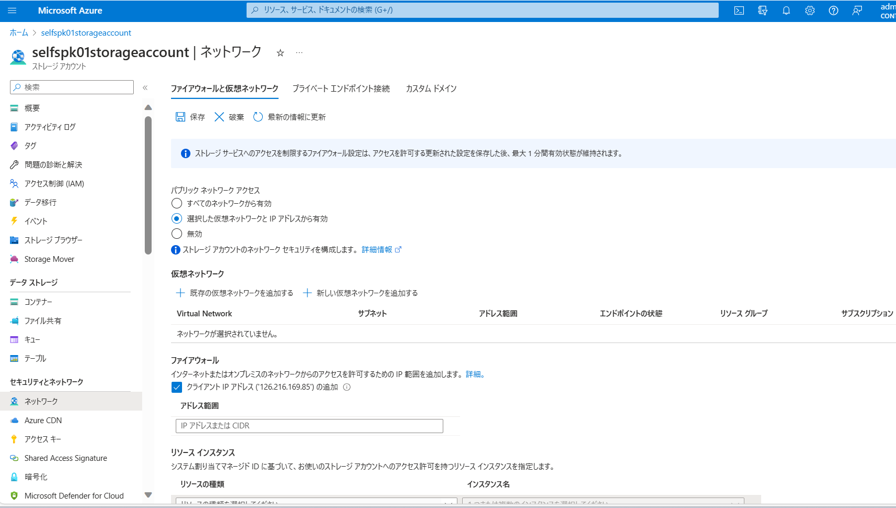
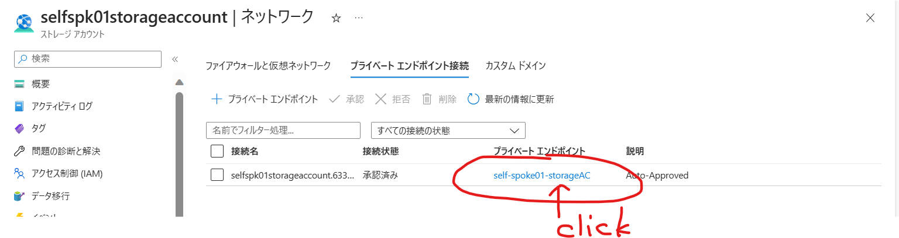
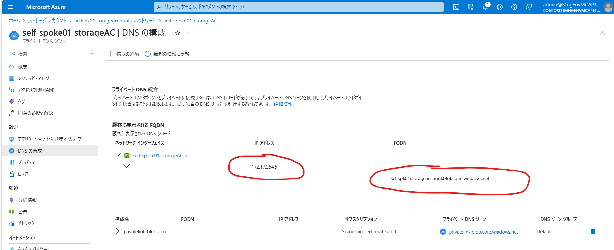
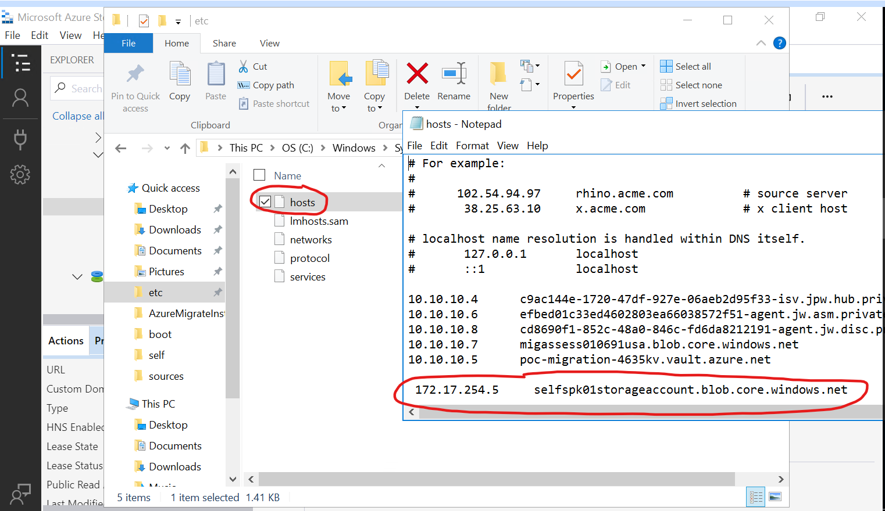
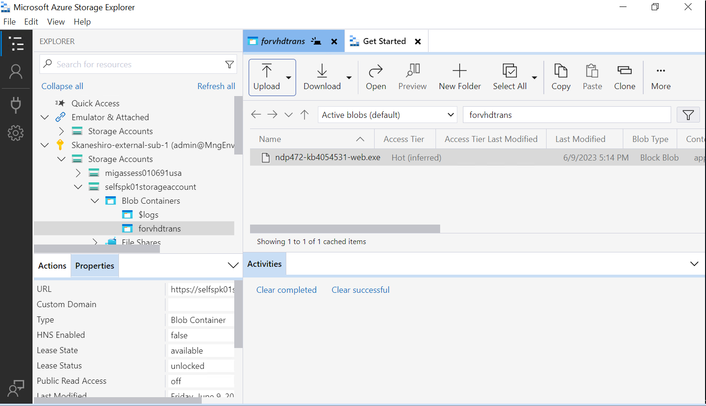
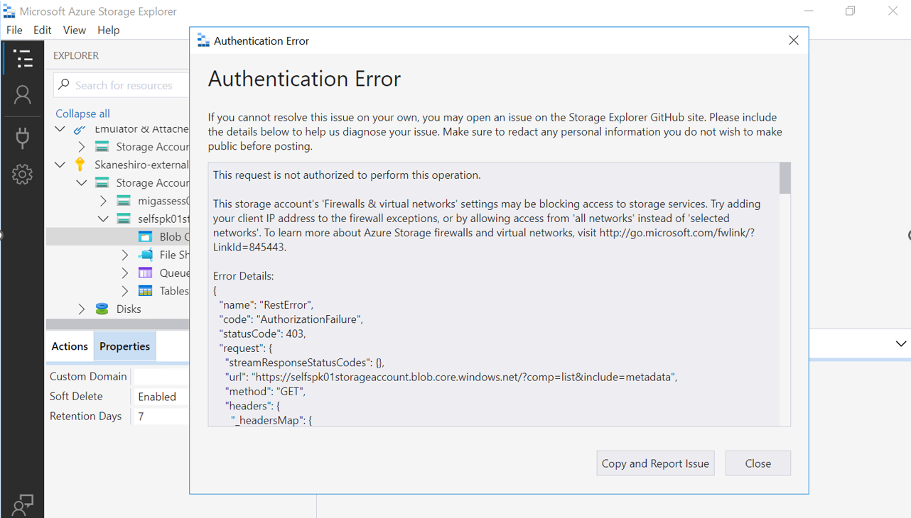

Azure Storage Explorer（ASE）はプライベートエンド経由でStorageAccountにアクセスすることは可能です。
下記の手順にてプライベートエンドポイントを含む操作を実施願います。
---------
#Azure Storage Explorerのインストーラーのダウンロードサイト
Azure Storage Explorer – cloud storage management | Microsoft Azure
---------

#パブリックネットからは指定のIPアドレスのみStorageAccountにアクセス可能にする手順
１．作成済みのStorageAccountのサイドメニューのカテゴリ「セキュリティとネットワーク」→「ネットワーク」をクリックします。

２．右側のメイン画面にてタブ「ファイアウォールと仮想ネットワーク」の「パブリックネットワークアクセス」の項目は”選択した仮想ネットワークとIPアドレス”にします。
※”無効”という選択肢はありますが、それにするとAzure PortalからStorageAccount内のデータ確認はできなくなり、確認作業に支障が出る恐れがあるかと思います。

３．カテゴリ「ファイアウォール」にてパブリックネットから通信を許可するIPアドレスまたはCIDRを「アドレス範囲」に追加します。
※現在Azure Portalを閲覧している端末のIPアドレスは単独で表示されているので、このIPアドレスのみアクセスを許可する場合はチェックボックスにチェックを入れます。
※ASEをインストールする端末（アプライアンスのサーバ？）が使用中のパブリックIPアドレスでの通信を許可しないでください。
（許可すると、ASEはそのパブリックIPを経由してStorageAccountにアクセスできてしまうためです）
※他の項目は変更不要

４．「保存」します
|
|:-:|

■StorageAccountのプライベートエンドポイントを作成する手順
１．上記手順の続きで、同画面のタブ「プライベートエンドポイント接続」をクリックして、プライベートエンドポイントを新規作成します。
（既存があれば作らなくても大丈夫です）

２．デプロイ済みのプライベートエンドポイントは同画面で確認できたら、青字の部分をクリックして、プライベートエンドポイントの詳細画面に遷移します。

３．プライベートエンドポイント画面のサイドメニュー「DNS構成」をクリックし、赤丸内のFQDNとIPアドレスをメモします。

４．メモした情報をASEインストール端末（アプライアンスのサーバ？）のhostsに追加し、再起動します。

---
＃プライベートエンドポイント作成後のアクセス確認
〇ASEでプライベートエンドポイントからStorageAccountに正常にアクセスできます。

×ASEでパブリックネットからStorageAccountにアクセスしようとすると下記のように認証エラーになります。

