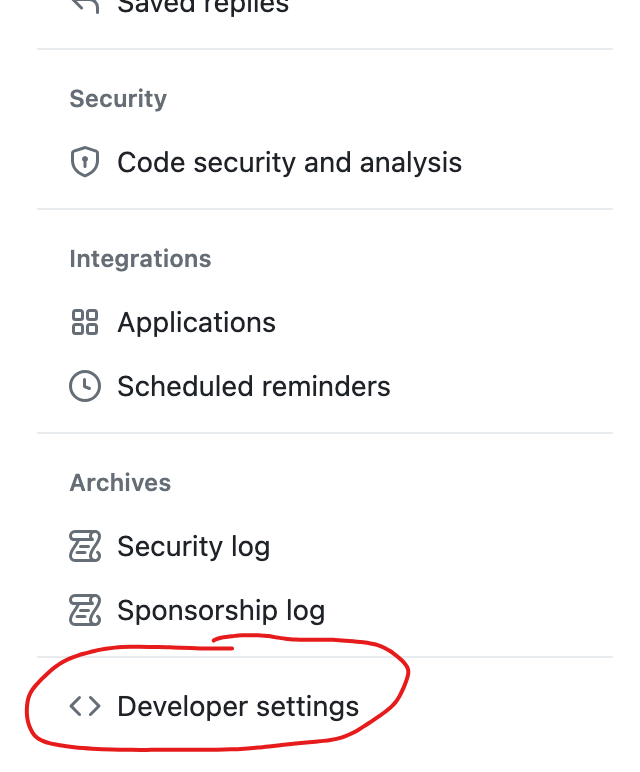
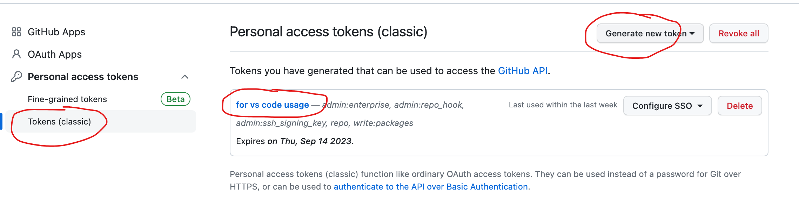

■ Clone a private github repo to VC code
1. GitHubにログイン > 右上にある自分のアイコンをクリック > [Settings]
2. [Developer settings] > [Personal access tokens] > [Generate new token]ボタンでトークンを生成する

3.
|
|:-:|

4.
|
|:-:|

 
 

5.ターミナルで下記コマンドを実施 
git clone https://<username>@github.com/skaneshiro_microsoft/for-private-usage.git
※usernameの後ろの部分はClone(SSH）のURLです

例：（自分の場合） 
git clone https://<skaneshiro_microsoft>@github.com/skaneshiro_microsoft/for-private-usage.git
 

6.passwordの入力のところはtoken値を入れてOK
